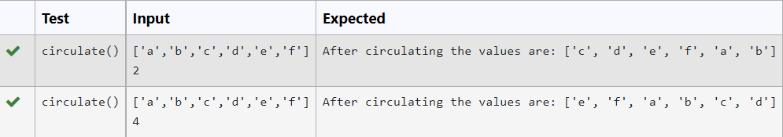
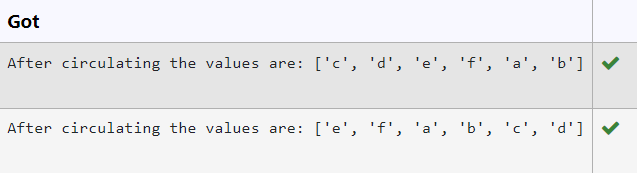

# Circulate-the-values-of-N-variables
## Aim:
To write a python program to circulate the n variables using function concept
## Equipment’s required:
PC
Anaconda - Python 3.7
## Algorithm: 
### Step 1:
Creating a finction named circulate

### Step 2:
Getting input for list and integer for circulating

### Step 3:
Get the value from the user for the number of rotation

## Step 4:
Using the slicing concept rotate the list

### Step 5:
Printing the list after circulating
## Program:
```python
def circulate():
    a=eval(input())
    x=int(input())
    print("After circulating the values are: {}".format(a[x:]+a[:x]))

```
## Output:



## Result:
The variables are circulated successfully.